# Extend Ad e-commerce app

## How to run the Project

1. **Install Dependencies from both workspaces**:

   ```bash
   npm run install:all
   ```

2. **In a terminal tab run the backend, runs at (http://localhost:5173/)**:

   ```bash
   cd backend && npm start
   ```

3. **In a terminal tab run the frontend, runs at (http://localhost:5002/)**:
   ```bash
   cd frontend && npm start
   ```

## Database configuration

Intsall postgresql locally and connect db it at (or change db creds at /src/dbconfig.ts)

```
// TypeORM DB init.
...
username: "mac",
password: "postgres",
database: "extenddb",
...
```

## Project Overview

- **Project Name**: Extend Ad e-commerce app
- **Description**: A full-stack e-commerce application where users can browse, search, filter, and manage products with CRUD functionalities. The app supports user authentication and authorization, with admin-specific operations like product creation and deletion. The responsive UI supports both mobile and desktop layouts.
- **Back-end Framework**: Express
- **Front-end Framework**: React
- **State Management**: Redux
- **Languages**: TypeScript
- **Database**: PostgreSQL (hosted locally)
- **ORM**: TypeORM

# Backend

## API Integration

The application uses REST API endpoints to handle product-related operations and user authentication.

### API Endpoints

- **Product Endpoints**:

  - `GET /products`: Retrieves paginated product listings.
  - `GET /products/categories`: Retrieves all the products categories.
  - `GET /products/:id`: Retrieves details of a specific product.
  - `POST /products`: (Admin) Creates a new product.
  - `PUT /products/:id`: (Admin) Updates an existing product.
  - `DELETE /products/:id`: (Admin) Deletes a product.

- **User Endpoints**:

  - `POST /users/login`: Logs in an existing user.
  - `GET /users/me`: Fetches current user details.
  - `POST /users`: Registers a new user.
  - `PUT /users`: Edit the current user.
  - `DELETE /users`: Deletes the current user.

- **Comment Endpoints**:

  - `POST /comments`: Creates a new product comment.

- **Review Endpoints**:
  - `POST /reviews`: Creates a new product review.

# Frontend

## Main UI Components

- **CataloguePage**: Displays the main product list page, allowing users to browse, search, and filter through available products. Located at `src/pages/CataloguePage.tsx`.
- **ProductPage**: Provides detailed information about a selected product, including name, description, price, and image. Located at `src/pages/ProductPage.tsx`.
- **AccountPage**: Shows user account details, allowing users to manage their personal information and view past activity. Located at `src/pages/AccountPage.tsx`.
- **LoginPage**: Renders the login form for user authentication and handles login functionality. Located at `src/pages/LoginPage.tsx`.
- **RegisterPage**: Displays the registration form, enabling new users to create an account. Located at `src/pages/RegisterPage.tsx`.
- **CreateProduct**: Part of the admin interface, this page allows authorized users to create a new product entry. Located at `src/pages/AdminPage/CreateProduct.tsx`.
- **EditProduct**: Also in the admin interface, this page allows authorized users to edit the details of an existing product. Located at `src/pages/AdminPage/EditProduct.tsx`.
- **AdminPage**: The main page for admin functionalities, including product management and user administration. Located at `src/pages/AdminPage.tsx`.

Each component has its own CSS module for styling, located in the `src/pages` folder, which ensures modular and maintainable styles.

## Responsive Design

The app is fully responsive, using CSS Modules and media queries. Layout adjustments are applied based on screen width, ensuring optimal display on mobile and desktop.

# Screenshots

- 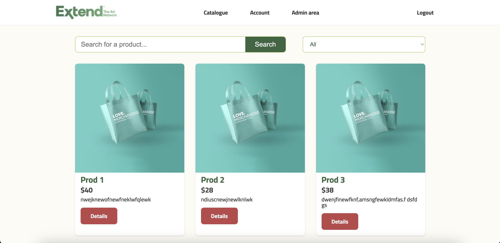
- 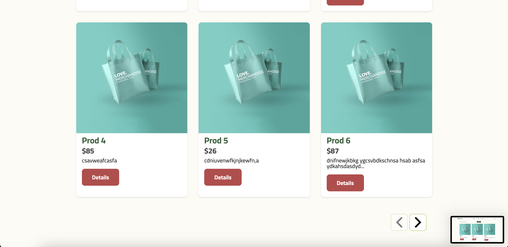
- 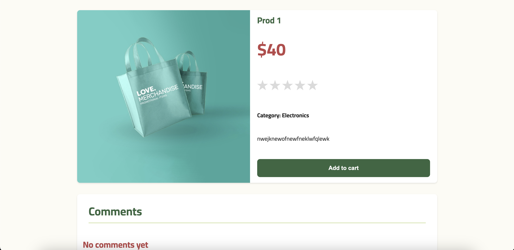
- 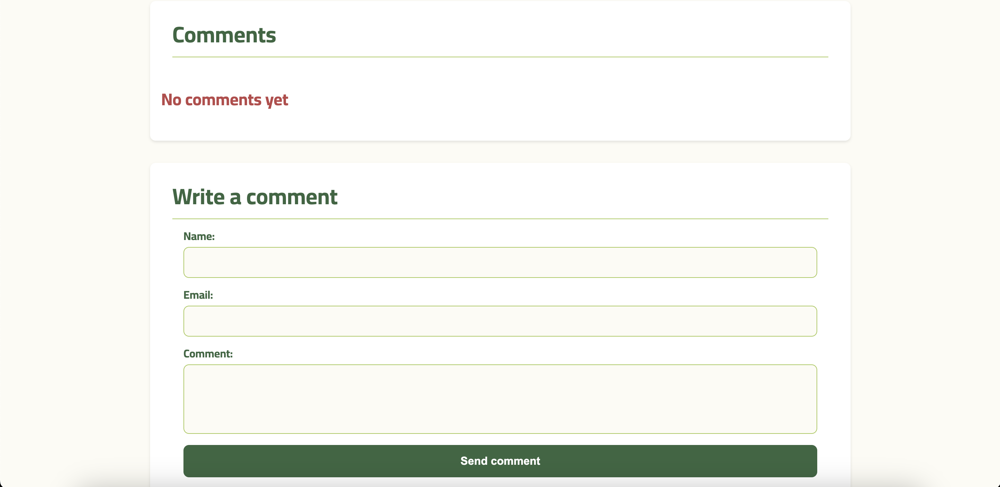
- 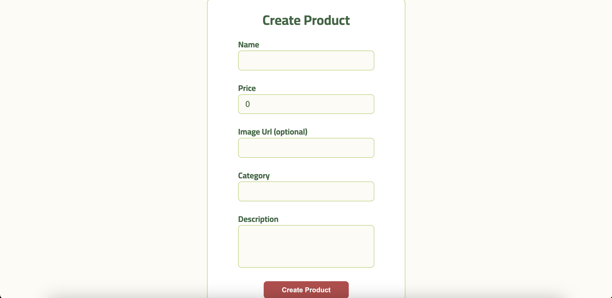
- 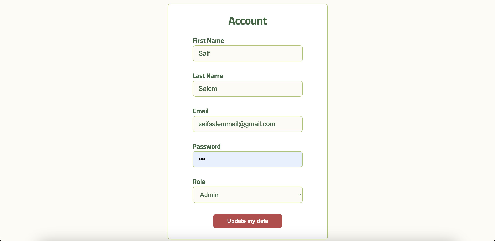
- 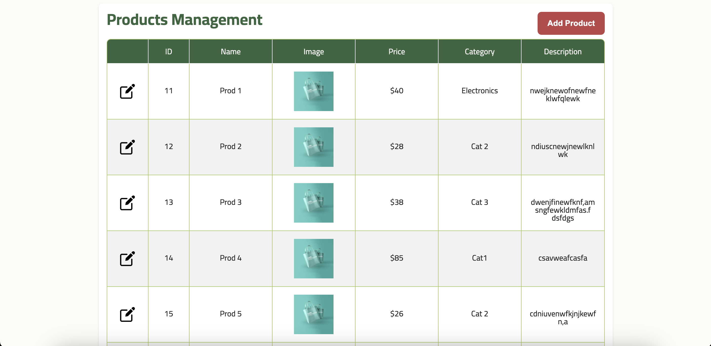
- 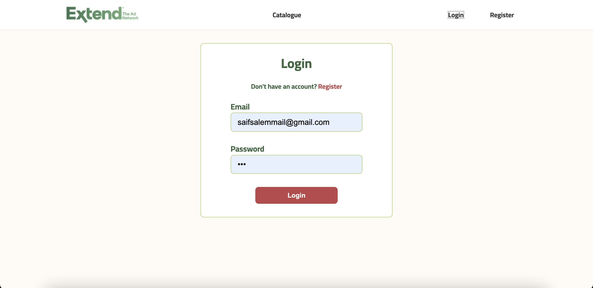
- 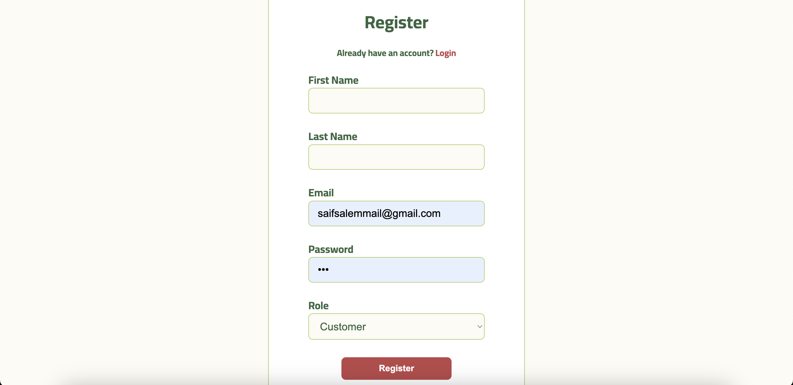
- 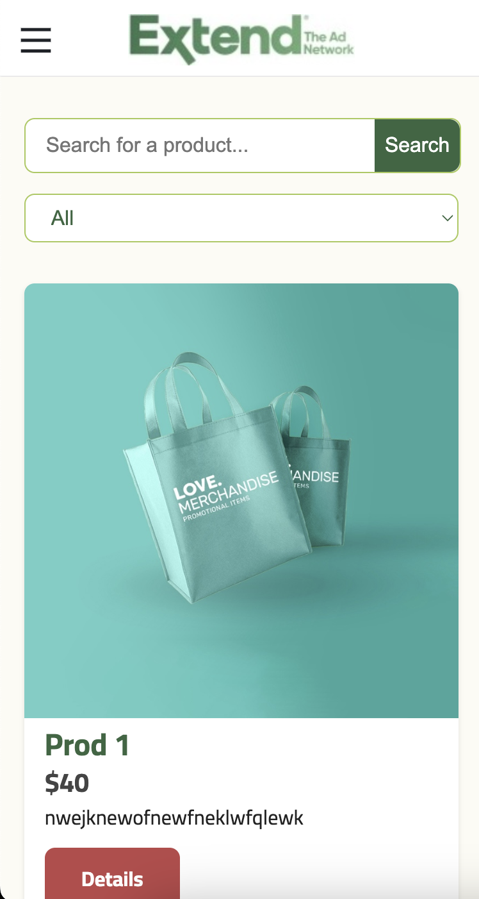
- 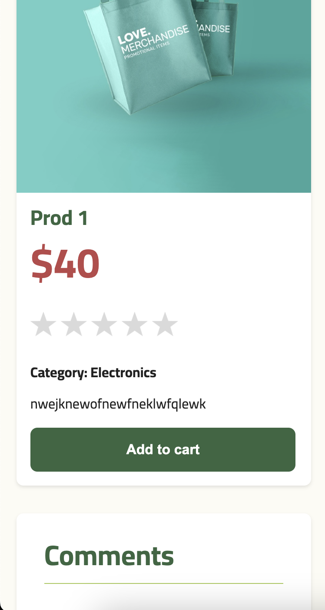
- 
